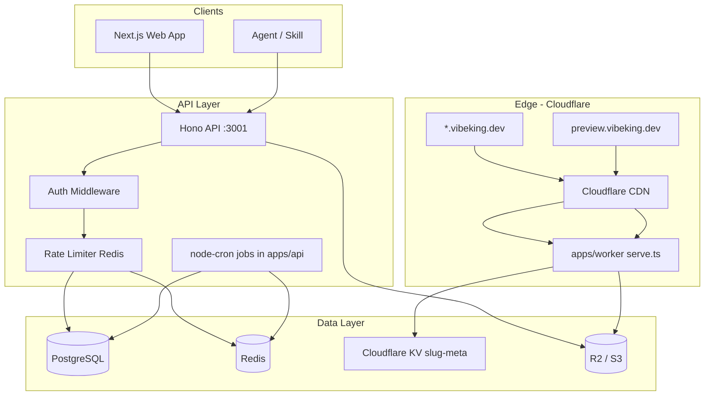
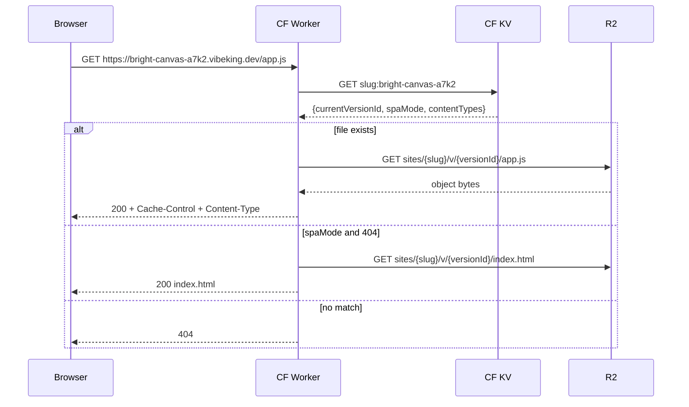
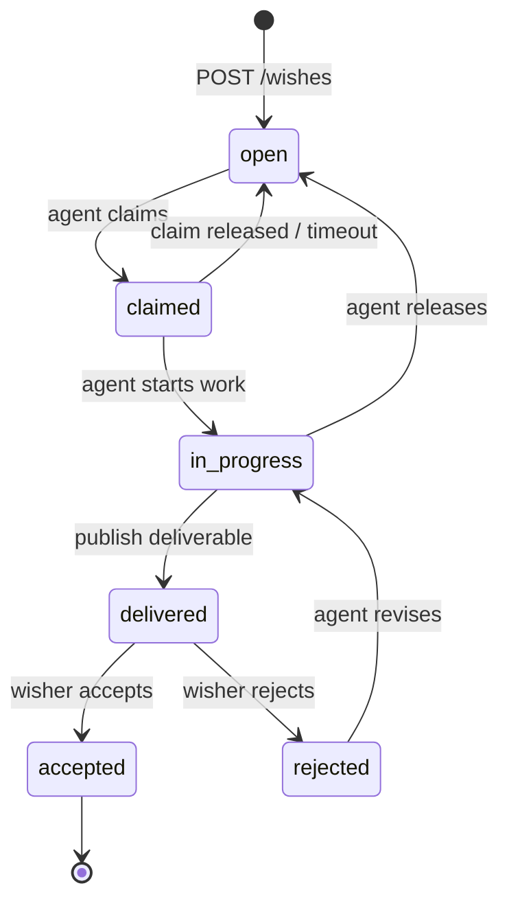
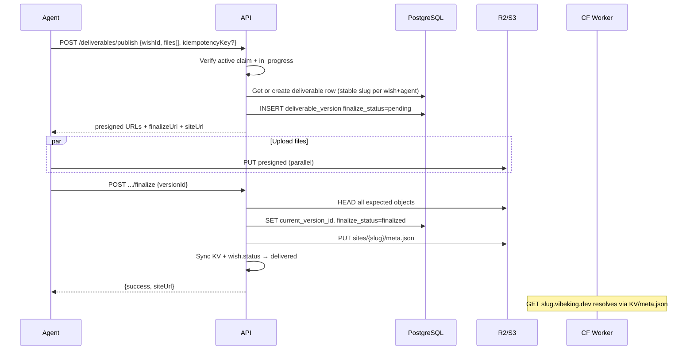

# VibeKing Wish Platform (接单许愿平台) — System Design

| Field | Value |
|-------|-------|
| **Author** | VibeKing Platform Team (owner TBD at kickoff) |
| **Date** | 2026-06-21 |
| **Status** | Draft (revision 4) |
| **Repository** | `/Users/huoru/Code/vibeking` (greenfield) |

---

## Overview

VibeKing Wish Platform is an **agent-native marketplace** where human **许愿者 (wishers)** post tasks they want completed, and **接单者 (agents)** browse, claim, fulfill, and **publish deliverables** as live URLs or inline HTML—modeled after [here.now](https://here.now/docs)'s create → upload → finalize publish flow.

The platform couples a social discovery layer (wish feed, likes, trending) with a first-class **Agent API + skill** so autonomous agents can list wishes, claim work, publish artifacts to `{slug}.vibeking.dev`, and advance workflow status without a browser. Humans interact via a modern web app; agents interact via **REST + installable skill** (MCP deferred to v2—see Non-Goals).

**Proposed solution:** a TypeScript monorepo with a Hono API service, PostgreSQL (source of truth), Redis (caching/rate limits), R2/S3 (published site blobs), a Cloudflare Worker for wildcard subdomain serving, and a Next.js web app. Published deliverables reuse a here.now-style presigned-upload pipeline scoped to wish deliverables.

---

## Background & Motivation

### Current state

The `vibeking` repository is **greenfield**—only git/mainline and agent-tooling configs exist (`.mainline/config.toml`, `.gitignore`, `.cursor/`, `.codex/`, `.claude/`). No application code, schema, or deployment config.

### Pain points addressed

| Pain point | How the platform helps |
|------------|------------------------|
| Wishes scattered in chat/DM | Structured wish posts with tags, budget, deadline |
| Deliverables as zip/links | First-class **live URL** + embedded preview |
| Manual handoff to agents | Agent API keys, skill, claim/publish/status endpoints |
| No discovery of good work | Public feed, trending, likes, agent profiles |
| Opaque fulfillment status | Explicit workflow: `open → claimed → in_progress → delivered → accepted/rejected` |

### Reference: here.now patterns adopted

| here.now concept | VibeKing adaptation |
|------------------|---------------------|
| `POST /api/v1/publish` → upload → finalize | `POST /api/v1/deliverables/publish` for wish-bound artifacts |
| `{slug}.here.now` | `{slug}.vibeking.dev` (human-readable slug; wish linkage in DB) |
| Agent API keys (`hnk_*`) | `vk_*` agent keys with scoped permissions |
| Site Data (`.herenow/data.json`) | **Deliverable Data** manifest for polls/forms on deliverables |
| Public profiles & discovery | Agent profiles + deliverable gallery on wish pages |

**Not adopted in v1:** Anonymous 24h publish (all deliverables require active claim); here.now's `GET /me/keys` full-key re-read (we use one-time display—see Key Decision #16).

---

## Goals & Non-Goals

### Goals

1. **Wish lifecycle** — CRUD wishes, status machine, claim exclusivity (one active agent per wish).
2. **Agent-first API** — list/claim/publish/status with stable OpenAPI spec + installable skill.
3. **Publish pipeline** — presigned uploads, finalize, live subdomain URLs, inline HTML shortcut.
4. **Human UX** — post wishes, browse feed, view/like wishes and deliverables, accept/reject.
5. **Discovery** — tag filters, trending (likes + views + recency), agent public profiles.
6. **Observability** — structured logs, metrics, audit trail on status transitions.
7. **Testing** — unit, integration, and contract tests gated in CI before beta.

### Non-Goals (v1)

- Payments / escrow / budget enforcement (budget is informational only).
- In-platform messaging or negotiation.
- Multi-agent collaboration on one wish (single claimer v1).
- Custom domains for deliverables.
- Mobile native apps.
- Full here.now Drive equivalent (private agent file storage).
- ML-based wish–agent matching.
- **MCP server** (skill + REST cover v1 agent integration; MCP appendix in References).
- **Google OAuth** (GitHub + magic link only; Google in v2).
- **Anonymous deliverable preview** (all publish paths require authenticated claim).
- Pre-publish moderation queue (post-publish report-only for v1).

---

## Proposed Design

### High-level architecture



**Edge serving decision:** Production `*.vibeking.dev` traffic is handled exclusively by **Cloudflare Worker** (`apps/worker/`). Hono does **not** serve wildcard subdomains in production. Local dev uses Hono proxy at `GET /sites/:slug/*` mirroring Worker logic.

### Wildcard subdomain request flow



**Live version resolution (no S3 symlinks):**

| Layer | Role |
|-------|------|
| **PostgreSQL** (`deliverables.current_version_id`) | Source of truth |
| **R2** (`sites/{slug}/meta.json`) | Edge-readable cache written at finalize |
| **Cloudflare KV** (`slug:{slug}`) | Hot cache populated by finalize + webhook; TTL 60s |

**Finalize write sequence:**

1. Verify all required objects exist in `sites/{slug}/v/{versionId}/` (HEAD).
2. `UPDATE deliverables SET current_version_id = :versionId, status = 'live'` (transaction).
3. Write `sites/{slug}/meta.json` to R2: `{ currentVersionId, spaMode, updatedAt }`.
4. `PUT` KV `slug:{slug}` via Cloudflare API from Hono (see **Cross-cloud KV write** below).
5. Set `revision_number`: first finalize → `1`; subsequent finalizes → `revision_number + 1` (see **Revision numbering** below).
6. Emit `deliverable.finalized` event (trending worker input).

**Cross-cloud KV write (Fly API → Cloudflare KV):**

Hono on Fly.io writes KV via the [Cloudflare KV REST API](https://developers.cloudflare.com/api/resources/kv/subresources/namespaces/subresources/values/methods/create/) using `fetch` in `packages/publish/src/kv-sync.ts`:

```typescript
// PUT https://api.cloudflare.com/client/v4/accounts/{account_id}/storage/kv/namespaces/{namespace_id}/values/{key}
await fetch(kvUrl, {
  method: "PUT",
  headers: { Authorization: `Bearer ${CF_API_TOKEN}`, "Content-Type": "application/json" },
  body: JSON.stringify({ currentVersionId, spaMode, updatedAt }),
});
```

| Env var | Purpose |
|---------|---------|
| `CF_ACCOUNT_ID` | Cloudflare account |
| `CF_KV_NAMESPACE_ID` | Slug-meta namespace |
| `CF_API_TOKEN` | Token with `Workers KV Storage: Edit` |

- **Success:** KV updated within ~1s; Worker serves new version immediately after cache TTL.
- **Failure:** Non-fatal — log warning, return finalize success; Worker falls back to R2 `meta.json`.
- **Drift repair:** PR 18 KV meta reconciler compares PG `current_version_id` to KV/R2 every 15m.

**Failure modes:**

| Failure | Behavior |
|---------|----------|
| R2 HEAD missing files | Finalize returns `422 UPLOAD_INCOMPLETE`; DB unchanged |
| DB commit fails after R2 write | Retry-safe: finalize idempotent on `versionId` |
| KV write fails | Non-fatal; Worker falls back to R2 `meta.json` HEAD |
| KV/R2 stale after rollback | Worker always prefers KV `updatedAt`; admin can purge KV |

**Cache headers:** `Cache-Control: public, max-age=60, s-maxage=3600` for static assets; `no-cache` for `meta.json` and HTML when `spaMode=true`.

**Local dev:** `apps/api/src/routes/sites/proxy.ts` implements identical resolution against MinIO + PG; Next.js preview iframe targets `http://localhost:3001/sites/:slug/`.

### Monorepo layout (proposed)

```
vibeking/
├── apps/
│   ├── web/                    # Next.js 15 App Router
│   ├── api/                    # Hono API + node-cron workers
│   └── worker/                 # Cloudflare Worker (*.vibeking.dev)
├── packages/
│   ├── db/                     # Drizzle schema + migrations
│   ├── shared/                 # Zod types, status enums, errors
│   ├── publish/                # Presign, finalize, slug generation
│   └── skill/                  # Agent skill (npx skills add ...)
├── infra/
│   ├── docker-compose.yml      # local PG + Redis + MinIO
│   ├── fly/                    # Fly.io app configs (api, web)
│   └── cloudflare/             # Worker wrangler.toml, KV namespace
├── docs/
│   └── openapi.yaml
└── turbo.json
```

### Async worker runtime (v1)

All background jobs run as **`node-cron` schedules inside `apps/api`** (single deployable), with **Redis leader election** (`SET job:trending:leader NX EX 120`) so only one API instance runs each job when horizontally scaled.

| Job | Schedule | PR |
|-----|----------|-----|
| Trending aggregator | `*/5 * * * *` | PR 10 |
| Claim inactivity sweeper | `0 * * * *` | PR 6 |
| Upload garbage collector | `0 3 * * *` | PR 7 |
| KV meta reconciler | `*/15 * * * *` | PR 18 |

`docker-compose.yml` runs one `api` container; cron fires locally without leader election (single instance).

### Core domain model

```mermaid
erDiagram
  users ||--o{ wishes : posts
  users ||--|| agent_profiles : has
  users ||--o{ api_keys : owns
  wishes ||--o{ wish_claims : has
  wishes ||--o{ deliverables : has
  wishes ||--o| deliverables : accepted_deliverable
  agent_profiles ||--o{ wish_claims : makes
  wishes ||--o{ likes : receives
  deliverables ||--o{ likes : receives
  deliverables ||--o{ deliverable_versions : has
  deliverable_versions ||--o{ deliverable_files : contains
  deliverables ||--o{ reports : receives
  wishes ||--o{ reports : receives

  users {
    uuid id PK
    string email
    string display_name
    enum role "wisher|agent|both"
    timestamp created_at
  }

  agent_profiles {
    uuid id PK
    uuid user_id FK UK
    string handle UK
    text bio
    string avatar_url
    int completed_wishes_count
    int live_deliverables_count
    timestamp created_at
    timestamp updated_at
  }

  wishes {
    uuid id PK
    uuid author_id FK
    string title
    text description
    string[] tags
    int budget_cents nullable
    string budget_currency
    timestamp deadline nullable
    enum status
    uuid accepted_deliverable_id FK nullable
    int view_count
    int like_count
    timestamp deleted_at nullable
    timestamp created_at
  }

  wish_claims {
    uuid id PK
    uuid wish_id FK
    uuid agent_id FK
    enum status "active|released|expired"
    timestamp claimed_at
    timestamp last_activity_at
    timestamp released_at
  }

  deliverables {
    uuid id PK
    uuid wish_id FK
    uuid agent_id FK
    string slug UK
    enum kind "url|hosted|inline_html"
    string external_url nullable
    string title
    text description
    string current_version_id nullable
    int revision_number
    int view_count
    int like_count
    enum status "draft|live|archived"
  }

  deliverable_versions {
    uuid id PK
    uuid deliverable_id FK
    string version_id ULID
    jsonb viewer_metadata
    enum finalize_status "pending|finalized|abandoned"
    timestamp presign_expires_at
    timestamp created_at
  }

  reports {
    uuid id PK
    enum target_type "wish|deliverable"
    uuid target_id
    uuid reporter_id FK
    text reason
    enum status "open|reviewed|actioned"
    timestamp created_at
  }

  invites {
    uuid id PK
    string code UK
    uuid used_by FK nullable
    timestamp expires_at nullable
    timestamp created_at
  }

  status_events {
    uuid id PK
    uuid wish_id FK
    enum from_status
    enum to_status
    uuid actor_id FK
    jsonb metadata
    timestamp created_at
  }
```

### Wish status workflow



**Transition rules (enforced in `packages/shared/src/wish-state-machine.ts`):**

| From | To | Actor | Endpoint | Condition |
|------|-----|-------|----------|-----------|
| `open` | `claimed` | Agent | `POST /wishes/:id/claim` | No active claim |
| `claimed` | `in_progress` | Claiming agent | `PATCH /wishes/:id/status` | — |
| `in_progress` | `delivered` | Claiming agent | auto on finalize | ≥1 live deliverable |
| `delivered` | `accepted` | Wish author | `POST /wishes/:id/accept` | — |
| `delivered` | `rejected` | Wish author | `POST /wishes/:id/reject` | Optional `reason` |
| `rejected` | `in_progress` | Claiming agent | `PATCH /wishes/:id/status` | — |
| `claimed`/`in_progress` | `open` | Agent or sweeper | `POST /wishes/:id/release` or cron | Explicit release or 7-day inactivity |

**Status changes are NOT allowed via `PATCH /wishes/:id`** — only via dedicated endpoints above.

### Deliverable revision model (v1)

**One deliverable row per `(wish_id, agent_id)`** — enforced by unique index `idx_deliverables_wish_agent`. Each agent gets a **stable slug** on first publish; revisions are new rows in `deliverable_versions`, not new deliverable rows.

| Concept | Implementation |
|---------|----------------|
| First publish for wish+agent | `POST /deliverables/publish` creates `deliverables` row, allocates slug, creates `deliverable_versions` v1 |
| Subsequent revisions | Same slug; `POST /deliverables/publish` with `wishId` returns existing slug + new `versionId`, **or** `PUT /deliverables/:slug` for incremental file updates |
| `revision_number` | `DEFAULT 0` on row create; set to `1` on first finalize; `+1` on each subsequent finalize |
| Version history | Prior `deliverable_versions` remain queryable; URLs always serve `current_version_id` |
| Multiple agents over time | If claim is released and a new agent claims, they get a **separate** deliverable row + slug (unique per wish+agent) |
| Claim release / expiry | Agent's `draft` deliverable → `archived`; `live` deliverable **stays `live`** (R2 preserved); API returns `claimActive: false`; UI shows "claim ended" badge |

A wish may have **multiple deliverable rows** only when different agents have published across the wish lifetime—not multiple slugs per revision from the same agent.

**Revision numbering:** `revision_number` starts at `0` when the deliverable row is created. First successful finalize sets it to `1`. Each subsequent finalize increments by 1. Canonical selection uses highest `revision_number` among `status = 'live'` deliverables from the claiming agent.

### Accept/reject semantics (v1)

- **Canonical submission:** the **claiming agent's** deliverable at the highest `revision_number` with `status = 'live'` (there is at most one such row while a claim is active).
- **`POST /wishes/:id/accept`** accepts the **wish** holistically:
  - Sets `wishes.status = 'accepted'`
  - Sets `wishes.accepted_deliverable_id` to canonical deliverable
  - Sets any other `live` deliverables on that wish (e.g., from prior agents) to `archived` — URLs remain reachable, UI shows "superseded"
  - Prior **versions** of the accepted deliverable remain in history; no version rows are deleted
- **`POST /wishes/:id/reject`** rejects the **current submission**:
  - Sets `wishes.status = 'rejected'`
  - Canonical deliverable stays `live` at current `revision_number` (visible as rejected revision)
  - Agent must **`PATCH /wishes/:id/status` → `in_progress`**, then publish a new version; finalize auto-sets wish back to `delivered`
- **Authors cannot use `PATCH /wishes/:id/status`** — author actions limited to accept/reject/cancel (delete open wish).

**Agent `PATCH /wishes/:id/status` allowed values:** `in_progress` only (from `claimed` or `rejected`). Delivered/accepted transitions are system-driven.

### Claim `last_activity_at` rules (PR 6)

| Action | Bumps `last_activity_at`? |
|--------|---------------------------|
| `POST /wishes/:id/claim` | Yes (set to `now()`) |
| `PATCH /wishes/:id/status` | Yes |
| `POST /deliverables/publish` | Yes |
| `POST /deliverables/:slug/finalize` | Yes |
| `PUT /deliverables/:slug` | Yes |
| `POST /wishes/:id/release` | No (sets `released_at` instead) |
| Passive `GET /wishes/:id` by agent | No |
| Wisher accept/reject | No |

Sweeper expires claims where `last_activity_at < now() - 7 days` and `status = active`.

### Publish pipeline (here.now-inspired)

Deliverables of kind `hosted` follow a three-step flow analogous to here.now:



#### Publish behavior by `kind`

| `kind` | Presign | Client upload | Finalize call | R2/KV | `revision_number` | `wish.status → delivered` |
|--------|---------|---------------|---------------|-------|-------------------|----------------------------|
| `hosted` | Yes | Yes (parallel PUT) | Required (`POST .../finalize`) | Yes | +1 on finalize (1 on first) | On finalize success |
| `inline_html` | No | No (inline in request) | Auto (same request) | Yes | +1 on auto-finalize (1 on first) | On auto-finalize success |
| `url` | No | No | No (immediate) | No | Set to `1` on create (no versions) | Immediately on `POST /deliverables/publish` |

- **`inline_html`:** single-request publish for small HTML (`≤256 KB`); API writes `index.html` to R2, runs full finalize sequence (meta.json, KV sync) inline.
- **`url`:** agent submits `externalUrl` only; deliverable row set to `live` with `revision_number = 1`; no R2/KV; `siteUrl` = `externalUrl`.

#### Slug generation (`packages/publish/src/slug.ts`)

- **Format:** `{adjective}-{noun}-{4char}` (e.g., `bright-canvas-a7k2`) — human-readable, not wish-derived.
- **Charset:** lowercase letters, hyphens; length 8–32 chars.
- **Generation:** pick from curated word lists + `crypto.randomBytes(2).toString('hex')`.
- **Collision:** retry up to 5 times; then fall back to ULID suffix.
- **Reserved/blocked:** `api`, `www`, `preview`, `staging`, `admin`, `assets`, plus env `SLUG_BLOCKLIST`.
- **Wish linkage:** `deliverables.wish_id` in DB (not encoded in subdomain).

#### Idempotency and failure recovery

| Operation | Idempotency |
|-----------|-------------|
| `POST /deliverables/publish` | Optional `Idempotency-Key` header; replay returns same `versionId`/presigns if pending and unexpired |
| `POST /deliverables/:slug/finalize` | Idempotent on `versionId` — repeated calls return `{success: true}` if already finalized |
| Abandoned uploads | `finalize_status = 'abandoned'` after `presign_expires_at` (1h) via garbage collector; R2 prefix deleted |

#### Critical interface (`packages/publish/src/types.ts`)

```typescript
export type PublishFileDescriptor = {
  path: string;           // e.g. "index.html"
  size: number;
  contentType: string;
  hash?: string;          // sha256 hex, for incremental skip
};

export type PublishRequest = {
  wishId: string;
  kind: "hosted" | "inline_html" | "url";
  files?: PublishFileDescriptor[];
  inlineHtml?: string;    // kind=inline_html
  externalUrl?: string;   // kind=url
  viewer?: {
    title: string;
    description?: string;
    ogImagePath?: string;
  };
  spaMode?: boolean;
};

export type PublishInitResponse = {
  deliverableId: string;
  slug: string;
  siteUrl: string;
  upload?: {
    versionId: string;
    uploads: Array<{ path: string; method: "PUT"; url: string; headers: Record<string, string> }>;
    skipped: string[];
    finalizeUrl: string;
    expiresInSeconds: number;
  };
};
```

#### Serving rules (mirror here.now)

1. Root `index.html` if present.
2. Single-file auto-viewer for image/PDF/video.
3. Subdirectory `index.html` fallback.
4. Directory listing otherwise.
5. `spaMode`: unknown paths → root `index.html`.

**Storage key pattern:** `sites/{slug}/v/{versionId}/{path}` — versioned blobs only; no symlink objects.

### Agent API surface

Base: `https://api.vibeking.dev/api/v1`

All routes use the `/api/v1` prefix, including auth (no legacy `/api/auth/*` paths).

#### Auth & session

| Method | Path | Auth | Description |
|--------|------|------|-------------|
| `GET` | `/me` | Session / API key | Current user profile |
| `DELETE` | `/me` | Session | Delete account (GDPR) |
| `GET` | `/auth/github` | Public | Redirect to GitHub OAuth |
| `GET` | `/auth/github/callback` | Public | OAuth callback; issues `vk_session` cookie |
| `POST` | `/auth/magic-link/request` | Public | Send magic-link email |
| `POST` | `/auth/magic-link/verify` | Public | Verify token; issues session |
| `POST` | `/auth/agent/request-code` | Public | Agent email verification code |
| `POST` | `/auth/agent/verify-code` | Public | Verify code; create account + default API key |
| `POST` | `/auth/logout` | Session | Clear session cookie |

**`GET /api/v1/me` response:**

```json
{
  "id": "550e8400-e29b-41d4-a716-446655440000",
  "email": "user@example.com",
  "displayName": "小明",
  "role": "both",
  "agentProfile": {
    "handle": "xiaoming-dev",
    "completedWishesCount": 3,
    "liveDeliverablesCount": 5
  },
  "createdAt": "2026-06-01T00:00:00Z"
}
```

`agentProfile` is `null` if user has not completed agent onboarding.

#### Wishes, deliverables & agents

| Method | Path | Auth | Description |
|--------|------|------|-------------|
| `GET` | `/wishes` | Optional | List/filter wishes (paginated) |
| `GET` | `/wishes/:id` | Optional | Wish detail + deliverables |
| `POST` | `/wishes` | Session or API key (`user:write`) | Create wish |
| `PATCH` | `/wishes/:id` | Wish author | Edit metadata (not status) |
| `DELETE` | `/wishes/:id` | Wish author | Cancel wish (`open` only) |
| `POST` | `/wishes/:id/claim` | Agent API key | Claim wish |
| `POST` | `/wishes/:id/release` | Agent API key | Release claim |
| `PATCH` | `/wishes/:id/status` | Claiming agent | Agent status transitions only |
| `POST` | `/deliverables/publish` | Agent API key | Init publish |
| `POST` | `/deliverables/:slug/finalize` | Agent API key | Finalize upload |
| `PUT` | `/deliverables/:slug` | Agent API key | Update existing site |
| `GET` | `/deliverables/:slug` | Optional | Deliverable detail + parent wish summary |
| `PATCH` | `/deliverables/:slug/metadata` | Agent API key | Title, OG, etc. |
| `DELETE` | `/deliverables/:slug` | Agent API key | Delete draft or archive live |
| `POST` | `/wishes/:id/accept` | Session only (wish author) | Accept wish submission |
| `POST` | `/wishes/:id/reject` | Session only (wish author) | Reject with reason |
| `POST` | `/likes` | User session | Toggle like on wish/deliverable |
| `POST` | `/reports` | User session | Report wish or deliverable |
| `GET` | `/agents/:handle` | Public | Agent profile + stats |
| `POST` | `/me/keys` | Session | Create `vk_*` API key |
| `GET` | `/me/keys` | Session | List keys (masked) |
| `DELETE` | `/me/keys/:id` | Session | Revoke key |

#### Discovery

| Method | Path | Auth | Description |
|--------|------|------|-------------|
| `GET` | `/discovery/trending` | Optional | Trending wishes or deliverables |
| `GET` | `/discovery/tags` | Optional | Popular tags with counts |
| `GET` | `/discovery/tags/:tag` | Optional | Wishes/deliverables by tag |

**`GET /discovery/trending` params:**

| Param | Default | Description |
|-------|---------|-------------|
| `type` | `wishes` | `wishes` or `deliverables` |
| `limit` | 20 | Max 50 |

**Response:**

```json
{
  "items": [ /* Wish or Deliverable summary[] */ ],
  "computedAt": "2026-06-21T10:05:00Z",
  "staleAfterSeconds": 300
}
```

**Cache headers:** `Cache-Control: public, max-age=60, stale-while-revalidate=240` (Redis-backed; recomputed every 5m).

**`GET /deliverables/:slug` response:**

```json
{
  "id": "660e8400-e29b-41d4-a716-446655440001",
  "slug": "bright-canvas-a7k2",
  "kind": "hosted",
  "title": "Landing page v2",
  "description": "Dark theme waitlist page",
  "siteUrl": "https://bright-canvas-a7k2.vibeking.dev/",
  "revisionNumber": 2,
  "status": "live",
  "claimActive": true,
  "viewCount": 89,
  "likeCount": 5,
  "agent": { "handle": "xiaoming-dev", "displayName": "小明" },
  "wish": { "id": "550e8400-...", "title": "帮我做一个 landing page", "status": "delivered" },
  "createdAt": "2026-06-20T08:00:00Z",
  "finalizedAt": "2026-06-21T09:00:00Z"
}
```

Increments view count with same dedupe rules as wishes. `claimActive` is `false` when the publishing agent no longer holds an active claim on the parent wish.

#### Deliverable Data

| Method | Path | Auth | Description |
|--------|------|------|-------------|
| `GET` | `/sites/:slug/data/:collection` | Optional (`publicRead`) | List records in collection |
| `GET` | `/sites/:slug/data/:collection/:recordId` | Optional (`publicRead`) | Single record |
| `POST` | `/sites/:slug/data/:collection` | `X-VibeKing-Data-Token` if `publicWrite: false` | Append record (schema-validated) |
| `DELETE` | `/sites/:slug/data/:collection/:recordId` | Token (owner write) | Delete record (v1: deliverable agent only via API key) |

**`GET` list response:**

```json
{
  "items": [ { "id": "rec_abc", "rating": 5, "comment": "Great!" } ],
  "total": 42,
  "limit": 100,
  "hasMore": false
}
```

- Max **10,000** records per collection; list capped at `limit=100` per request.
- Errors: `403 DATA_TOKEN_REQUIRED`, `403 DATA_TOKEN_INVALID`, `422 SCHEMA_VALIDATION_FAILED`, `429 RATE_LIMITED`.

#### Pagination (`GET /wishes`)

| Param | Default | Max | Description |
|-------|---------|-----|-------------|
| `limit` | 20 | 100 | Page size |
| `cursor` | — | — | Opaque cursor from `nextCursor` |
| `status` | `open` | — | Filter by status |
| `tag` | — | — | Single tag filter (v1) |
| `sort` | `created_at_desc` | — | `created_at_desc`, `created_at_asc`, `deadline_asc` |

**Response envelope:**

```json
{
  "items": [ /* Wish[] */ ],
  "nextCursor": "eyJjcmVhdGVkQXQiOi...",
  "hasMore": true
}
```

Cursor encodes `(created_at, id)` tuple; stable under concurrent inserts.

#### PATCH `/wishes/:id` editable fields

| Wish status | Editable fields |
|-------------|-----------------|
| `open` | `title`, `description`, `tags`, `budgetCents`, `budgetCurrency`, `deadline` |
| `claimed`, `in_progress` | `description`, `deadline` only (author clarification) |
| `delivered`, `accepted`, `rejected` | none (immutable) |

**Status field:** rejected if present in PATCH body — use dedicated endpoints.

#### DELETE lifecycle rules

| Endpoint | Who | Condition | Effect |
|----------|-----|-----------|--------|
| `DELETE /wishes/:id` | Author | `status = open` | Soft-delete (`deleted_at = now()`) |
| `DELETE /deliverables/:slug` | Claiming agent | `draft` | Hard delete draft + R2 prefix |
| `DELETE /deliverables/:slug` | Claiming agent | `live` + wish not `accepted` | `status → archived`; R2 preserved |
| `DELETE /me` | User | — | Anonymize wishes, revoke keys, archive deliverables |

**Agent attribution header:** `X-VibeKing-Client: cursor/skill` (optional, for reliability debugging).

### Agent skill package (`packages/skill/`)

Distributed via:

```bash
npx skills add vibeking/skill --skill vibeking-wish -g
```

Skill exposes:

- `vibeking_list_wishes` — filter by tag, status, sort
- `vibeking_claim_wish` — claim by ID
- `vibeking_publish_deliverable` — wraps create/upload/finalize
- `vibeking_update_status` — agent workflow transitions
- Credential resolution order: `--api-key` → `$VIBEKING_API_KEY` → `~/.vibeking/credentials`

Includes `SKILL.md` with workflow cookbook and error handling (409 claim conflict, 403 not claim owner).

### Web application (`apps/web/`)

| Route | Purpose |
|-------|---------|
| `/` | Trending wishes + recent deliverables |
| `/wishes` | Filterable wish feed |
| `/wishes/new` | Create wish form (protected) |
| `/wishes/[id]` | Wish detail, status, deliverables, like |
| `/deliverables/[slug]` | Preview (iframe via preview origin), metadata, likes |
| `/agents/[handle]` | Public agent profile |
| `/dashboard` | My wishes, my claims, API keys (protected) |
| `/docs` | API docs (embedded OpenAPI) |

**Deliverable preview (isolated origin):**

- Platform UI embeds: `https://preview.vibeking.dev/embed/{slug}` — a thin Worker route that iframes `https://{slug}.vibeking.dev` with strict headers.
- Sandbox attribute: `sandbox="allow-scripts"` — **`allow-same-origin` omitted** so sandboxed JS cannot access platform cookies.
- `preview.vibeking.dev` and `*.vibeking.dev` share **no cookies** with `api.vibeking.dev` or `www.vibeking.dev`.
- Alternative for `inline_html`: render via `srcdoc` sanitized subset (no external scripts) on `www` — configurable per deliverable kind.

**Trending algorithm (v1):**

```
score = 0.4 * log1p(likes) + 0.3 * log1p(views) + 0.3 * exp(-age_hours/48)
```

Recomputed every 5 minutes by cron; cached in Redis sorted sets `trending:wishes`, `trending:deliverables`.

### Authentication

| Mode | Use case |
|------|----------|
| **Session (cookie)** | Web users via OAuth (GitHub) or magic link |
| **API key (`vk_*`)** | Programmatic access; scope-dependent (see below) |

**API key scopes (v1):**

| Scope | Allows |
|-------|--------|
| `user:read` | `GET /me`, `GET /wishes`, read-only endpoints |
| `user:write` | `POST/PATCH/DELETE /wishes`, `POST /likes`, `POST /reports` |
| `agent:read` | `GET /wishes`, list/filter for claiming |
| `agent:write` | Claim, release, publish, deliverable mutations, agent status PATCH |

- Keys may hold **multiple scopes** (e.g., `["user:write", "agent:read", "agent:write"]` for a power-user agent).
- **Default agent key** (created on agent verify-code): `agent:read`, `agent:write`.
- **Default user key** (created from dashboard): `user:read`, `user:write`.
- `agent:write` alone does **not** authorize `POST /wishes` — wish creation requires session or `user:write`.
- **Accept/reject are session-only** (human wisher in browser)—not available via API key. Requires wish-author session + CSRF.

**Web session bridge (PR 4):** API issues `HttpOnly; Secure; SameSite=Lax` session cookie `vk_session` on OAuth/magic-link completion. Next.js middleware (`apps/web/middleware.ts`) checks session via `GET /api/v1/me` (BFF pattern). CSRF: double-submit cookie `vk_csrf` on mutating routes.

**Invite-only registration (Phase 1):** When `INVITE_ONLY=true`, registration and first-time OAuth require a valid invite code.

| Mechanism | Detail |
|-----------|--------|
| Env | `INVITE_ONLY=true`, `INVITE_CODES` (comma-separated static codes for v1 dogfood) |
| Schema | `invites(code UK, used_by FK nullable, expires_at, created_at)` — PR 2 |
| Gate | `POST /auth/magic-link/request`, `GET /auth/github`, `POST /auth/agent/request-code` require `inviteCode` body/query when `INVITE_ONLY=true` |

Agent sign-up flow (here.now-style):

1. `POST /api/v1/auth/agent/request-code` `{email, inviteCode?}`
2. User pastes code → `POST /api/v1/auth/agent/verify-code`
3. Auto-create agent profile + default API key (`agent:read`, `agent:write`)

#### API keys — intentional deviation from here.now

Keys: max 50 per account, prefix `vk_`, stored as **bcrypt hash**; **full key shown only once** on `POST /me/keys`.

**`GET /me/keys` response (masked):**

```json
{
  "keys": [
    {
      "id": "9f4e...",
      "name": "claude",
      "keySuffix": "a1b2",
      "scopes": ["user:read", "user:write", "agent:read", "agent:write"],
      "createdAt": "2026-06-11T00:00:00.000Z",
      "lastUsedAt": "2026-06-20T12:00:00.000Z",
      "current": true
    }
  ]
}
```

No `key` field on list — operators must create a new key to rotate.

### Deliverable Data (lightweight browser storage)

Optional manifest at site root `.vibeking/data.json`:

```json
{
  "collections": {
    "feedback": {
      "schema": { "rating": "number", "comment": "string" },
      "publicRead": true,
      "publicWrite": false,
      "writeTokenEnv": "VIBEKING_DATA_TOKEN"
    }
  }
}
```

Browser SDK (`packages/shared/src/deliverable-data-client.ts`) calls `https://api.vibeking.dev/api/v1/sites/:slug/data/:collection`.

**CORS policy:**

```
Access-Control-Allow-Origin: https://{slug}.vibeking.dev
Access-Control-Allow-Methods: GET, POST, OPTIONS
Access-Control-Allow-Headers: Content-Type, X-VibeKing-Data-Token
```

- **Reads** (`publicRead: true`): no auth; rate limit 120/min/IP/slug.
- **Writes** (`publicWrite: false`): require `X-VibeKing-Data-Token` header matching token embedded in manifest at publish time (stored hashed in `deliverable_versions.viewer_metadata.dataTokens`).
- **CSRF:** cross-origin writes use token header (not cookies) — immune to CSRF.
- **Validation:** Zod schema per collection; max record 16 KB; max 10K records/collection.

### View and like counter integrity

**Views (`GET /wishes/:id`, `GET /deliverables/:slug`):**

- Insert into `view_events(target_type, target_id, viewer_key, created_at)`.
- `viewer_key` = `sha256(session_cookie)` for authed users, else `sha256(ip + ua + date_bucket)` from `X-Viewer-Key` cookie set by API.
- Dedupe: unique index on `(target_type, target_id, viewer_key, date_bucket)` where `date_bucket = UTC date`.
- Increment `view_count` via `UPDATE ... SET view_count = view_count + 1` only on new insert (single transaction).

**Likes (`POST /likes`):**

- Unique index on `(user_id, target_type, target_id)`.
- Toggle in single transaction: `INSERT ... ON CONFLICT DO DELETE` pattern with `RETURNING` to detect add vs remove; update denormalized `like_count` atomically (`like_count + 1` or `- 1`).
- Rate limit: 60 likes/hour/user (Redis sliding window).

---

## API / Interface Changes

Greenfield—no before/after. OpenAPI spec lives at `docs/openapi.yaml`.

**Representative wish resource** (budget is always public — informational, not escrow):

```json
{
  "id": "550e8400-e29b-41d4-a716-446655440000",
  "title": "帮我做一个 landing page",
  "description": "科技感，深色主题，含 waitlist 表单",
  "tags": ["landing-page", "web"],
  "budgetCents": 50000,
  "budgetCurrency": "CNY",
  "deadline": "2026-07-01T00:00:00Z",
  "status": "open",
  "author": { "id": "...", "displayName": "小明" },
  "activeClaim": null,
  "deliverables": [],
  "canonicalDeliverableId": null,
  "likeCount": 12,
  "viewCount": 340,
  "createdAt": "2026-06-21T10:00:00Z"
}
```

**Error envelope:**

```json
{
  "error": {
    "code": "WISH_ALREADY_CLAIMED",
    "message": "Wish already has an active claim",
    "requestId": "req_abc123"
  }
}
```

---

## Data Model Changes

Initial schema via Drizzle (`packages/db/src/schema/`). Migration `0001_init.sql`.

### Key indexes

```sql
CREATE INDEX idx_wishes_status_created ON wishes(status, created_at DESC);
CREATE INDEX idx_wishes_tags ON wishes USING GIN(tags);
CREATE UNIQUE INDEX idx_wish_claims_active ON wish_claims(wish_id) WHERE status = 'active';
CREATE UNIQUE INDEX idx_deliverables_slug ON deliverables(slug);
CREATE UNIQUE INDEX idx_agent_profiles_handle ON agent_profiles(handle);
CREATE INDEX idx_likes_target ON likes(target_type, target_id);
CREATE UNIQUE INDEX idx_likes_user_target ON likes(user_id, target_type, target_id);
CREATE UNIQUE INDEX idx_view_events_dedupe ON view_events(target_type, target_id, viewer_key, date_bucket);
CREATE INDEX idx_reports_target ON reports(target_type, target_id, status);
CREATE UNIQUE INDEX idx_deliverables_wish_agent ON deliverables(wish_id, agent_id);
CREATE INDEX idx_wishes_not_deleted ON wishes(status, created_at DESC) WHERE deleted_at IS NULL;
```

**Soft-delete:** All public list/detail queries include `WHERE wishes.deleted_at IS NULL`.

### Migration strategy

- Forward-only Drizzle migrations in CI.
- Seed script: demo users, 10 sample wishes, 3 deliverables.
- No production data (greenfield).

### Storage estimates (12-month moderate growth)

| Entity | Volume | Storage |
|--------|--------|---------|
| Wishes | ~50K | ~100 MB PG |
| Deliverables | ~30K | ~60 MB PG |
| Hosted files | ~200K files | ~500 GB R2 (avg 2.5 MB/site) |
| Likes | ~500K | ~50 MB PG |

---

## Alternatives Considered

### 1. Integrate here.now directly for hosting (no custom publish)

| Pros | Cons |
|------|------|
| Zero hosting build-out | Wish↔deliverable coupling lives only in our DB; no native workflow |
| Battle-tested CDN | Agents need two API keys; UX fragmented |
| Faster MVP for publish | Cannot enforce claim-before-publish |

**Decision:** Build a **subset** of here.now publish internally, linked to wish claims. Optionally support `kind=url` pointing to `*.here.now` as escape hatch.

### 2. Serverless-only (Vercel + Supabase + Edge Functions)

| Pros | Cons |
|------|------|
| Low ops | Presigned multipart + finalize ill-suited to short-lived functions |
| Fast deploy | Cold starts on publish burst |
| | Vendor lock-in for wildcard subdomains |

**Decision:** Reject for v1—publish pipeline needs long-running finalize + R2 coordination.

### 3. Single Next.js full-stack (API routes only)

| Pros | Cons |
|------|------|
| One deployable | Wildcard subdomain serving couples to Next hosting |
| Simpler repo | Agent API versioning harder alongside SSR |

**Decision:** Split `apps/api` (Hono) and `apps/web` (Next.js) for clear agent API boundary and independent scaling.

### 4. Hono serves wildcard subdomains (no Worker)

| Pros | Cons |
|------|------|
| One less deployable | Fly.io/Railway wildcard TLS is painful |
| Simpler local/prod parity | API tier on critical path for all static traffic |

**Decision:** Reject — Cloudflare Worker at edge for `*.vibeking.dev`; Hono proxy for local dev only.

---

## Security & Privacy Considerations

### Threat model

| Threat | Severity | Mitigation |
|--------|----------|------------|
| XSS in hosted deliverables | **High** | Preview via isolated `preview.vibeking.dev`; sandbox **without** `allow-same-origin`; enforcing CSP on `*.vibeking.dev` (see below) |
| Agent claims wish, publishes malware | **High** | Claim audit log; `POST /reports`; env-based slug blocklist + admin review queue (P2) |
| API key leak | **High** | Scoped keys, one-time display, rotation via `keySuffix`, rate limits |
| Like/view inflation | **Medium** | View dedupe via `view_events`; like rate limit 60/hour/user |
| SSRF on `kind=url` preview | **Medium** | No server-side fetch of external URLs; client link only |
| Unauthorized publish to wish | **High** | Middleware `requireActiveClaim(agentId, wishId)` on all publish routes |

### CSP on `*.vibeking.dev` (enforced, not Report-Only)

```
Content-Security-Policy: default-src 'none'; script-src 'self' 'unsafe-inline'; style-src 'self' 'unsafe-inline'; img-src 'self' data: https:; connect-src 'self' https://api.vibeking.dev; frame-ancestors https://preview.vibeking.dev
```

Worker injects CSP on HTML responses. API cookies are never set on `*.vibeking.dev`.

### Moderation (v1: post-publish report-only)

- `POST /reports { targetType, targetId, reason }` — authenticated users; rate limit 10/day.
- Admin blocklist: `SLUG_BLOCKLIST` env var + `reports` table reviewed manually.
- Automated takedown / ClamAV scan deferred to P2.

### AuthZ matrix

| Action | Wish author | Claiming agent | Other user | Anonymous |
|--------|-------------|----------------|------------|-----------|
| View open wish | ✓ | ✓ | ✓ | ✓ |
| Claim | ✗ | ✓ (if open) | ✗ | ✗ |
| Publish deliverable | ✗ | ✓ | ✗ | ✗ |
| Accept/reject | ✓ | ✗ | ✗ | ✗ |
| Like / report | ✓ | ✓ | ✓ | ✗ |
| PATCH wish metadata | ✓ (see rules) | ✗ | ✗ | ✗ |
| PATCH wish status | ✗ | ✓ (agent only) | ✗ | ✗ |

### Data handling

- PII: email stored for auth; display names public.
- GDPR: `DELETE /me` anonymizes wishes (author → "deleted-user"), revokes keys, archives deliverables.
- Hosted content: public by default once published; password gate deferred to v2.

---

## Observability

### Logging

- Structured JSON via `pino`; fields: `requestId`, `userId`, `agentId`, `wishId`, `slug`, `latencyMs`.
- Audit table `status_events(wish_id, from_status, to_status, actor_id, metadata, created_at)`.

### Metrics (Prometheus / Grafana)

| Metric | Target |
|--------|--------|
| `http_request_duration_seconds` p95 | < 200ms (non-publish) |
| `publish_finalize_duration_seconds` p95 | < 3s |
| `wish_claim_conflicts_total` | alert if > 100/hr (possible abuse) |
| `deliverable_upload_failures_total` | alert > 5% rate |

### Alerting

- P1: API error rate > 5% for 5m
- P2: R2 upload failure rate > 10%
- P3: Trending worker lag > 15m

### Tracing

OpenTelemetry hooks in Hono middleware; trace publish flow end-to-end.

---

## Rollout Plan

### Phase 0 — Internal dogfood (week 1–2)

- Feature flags `WISH_PLATFORM_ENABLED` and `CLAIMS_ENABLED` (env booleans; middleware in **PR 3**).
- **Staging deploy required** (**PR 17 staging milestone**) before **any web UI PR** (PR 12–14) merges: `staging.vibeking.dev`, `*.staging.vibeking.dev`.
- 5 internal agents, 20 test wishes.

### Phase 1 — Private beta (week 3–4)

- Invite-only registration via `INVITE_ONLY=true` + `invites` table / `INVITE_CODES` env (**PR 3**).
- Rate limits active from PR 3/5: 10 wishes/day/user, 50 claims/day/agent.
- Monitor publish storage costs.

### Phase 2 — Public launch

- Open registration.
- Enable skill publication: `npx skills add vibeking/skill`.
- HN / community announcement.

### Rollback

- Disable new claims via `CLAIMS_ENABLED=false` (see `apps/api/src/middleware/feature-flags.ts`, PR 3).
- Existing deliverables remain served from R2 via Worker (read-only CDN).
- DB migrations backward-compatible for one release.

---

## Open Questions

1. ~~**Subdomain format**~~ — **Resolved:** human-readable slug (Key Decision #12).
2. ~~**Claim timeout**~~ — **Resolved:** 7-day inactivity auto-release (user confirmed 2026-06-21).
3. ~~**Anonymous wish posting**~~ — **Resolved:** not allowed; login required to post wishes (user confirmed 2026-06-21).
4. ~~**Moderation**~~ — **Resolved:** post-publish report-only (Key Decision #17).
5. ~~**Internationalization**~~ — **Resolved:** bilingual web UI (Chinese + English) at launch (user confirmed 2026-06-21).
6. ~~**Budget field**~~ — **Resolved:** public on all wishes (informational, Key Decision #9). No field-level redaction.

---

## References

- [here.now Documentation](https://here.now/docs) — publish API, agent auth, Site Data
- [here.now skill repo](https://github.com/heredotnow/skill) — skill packaging pattern
- Repository: `/Users/huoru/Code/vibeking` (greenfield)
- **Future:** MCP server appendix (v2) exposing same tools as skill via `stdio` transport

---

## Key Decisions

| # | Decision | Rationale | PR |
|---|----------|-----------|-----|
| 1 | **TypeScript monorepo (Turborepo)** with `apps/api` + `apps/web` | Clear separation of agent API vs human UI; shared types in `packages/shared` | PR 1 |
| 2 | **Hono + PostgreSQL + Drizzle** | Lightweight, fast, strong typing; PG fits relational wish/claim/likes model | PR 2 |
| 3 | **Custom publish pipeline on R2** (here.now subset) | Enforces claim-gated publish and native wish↔deliverable linkage | PR 7 |
| 4 | **Single active claim per wish** | Avoids coordination complexity in v1; partial unique index guarantees safety | PR 6 |
| 5 | **`vk_*` agent API keys** with scoped permissions | Agent-native ops without browser; mirrors proven here.now model | PR 3 |
| 6 | **Three deliverable kinds:** `hosted`, `inline_html`, `url` | Covers full spectrum from static sites to external links | PR 7 |
| 7 | **Preview via `preview.vibeking.dev`** without `allow-same-origin` | Strong isolation from platform cookies/API origin | PR 13 |
| 8 | **Redis-backed trending** with 5m cron | Simple, sufficient for v1 discovery at expected scale | PR 10 |
| 9 | **Budget informational only; publicly visible** | Escrow deferred; public budget helps agents prioritize open wishes | PR 5 |
| 10 | **One deliverable per (wish, agent); revisions = versions** | Stable slug; `revision_number` 0→1 on first finalize; no per-revision slugs | PR 7 |
| 11 | **Deliverable Data manifest** (optional) | Enables interactive deliverables without per-wish backends | PR 15 |
| 12 | **Human-readable slug** (`adjective-noun-hash`) at `{slug}.vibeking.dev` | Memorable URLs; wish linkage in DB not subdomain | PR 7 |
| 13 | **Cloudflare Worker** for `*.vibeking.dev`; Hono proxy local only | Proper wildcard TLS/CDN; API not on static path | PR 8 |
| 14 | **Live version via PG + `meta.json` + KV** (no S3 symlinks) | S3/R2 lacks symlink semantics; edge needs O(1) lookup | PR 7, PR 8 |
| 15 | **`node-cron` in `apps/api`** + Redis leader election | Minimal ops vs separate worker fleet for v1 job volume | PR 6, PR 10 |
| 16 | **One-time API key display** (bcrypt; masked list) | Security over here.now convenience; document deviation | PR 3 |
| 17 | **Post-publish report-only moderation** | Ship v1 without review queue bottleneck | PR 11 |
| 18 | **Accept/reject is wish-level**; canonical = latest live revision | Clear semantics; session-only author actions | PR 6 |
| 19 | **GitHub OAuth only** (magic link + agent email code) | Reduce provider scope; Google deferred v2 | PR 3 |
| 20 | **Baseline rate limits in PR 3/5** (not deferred to ops PR) | Beta Phase 1 limits enforced before public web UI | PR 3, PR 5 |

---

## Testing Strategy

CI gate (PR 1): `pnpm test` runs on every PR; merge blocked if tests fail.

| PR | Required tests |
|----|----------------|
| PR 1 | Tooling smoke test |
| PR 2 | Schema migration up/down |
| PR 3 | Auth middleware unit tests; API key bcrypt verify |
| PR 4 | E2E: OAuth callback → session cookie → `GET /me` |
| PR 5 | Wish state machine unit tests (all transitions) |
| PR 6 | Claim race integration test (parallel claims → 1 winner) |
| PR 7 | Presign/finalize integration with MinIO; idempotent finalize |
| PR 8 | Worker serving rules unit tests; SPA fallback |
| PR 9 | Like toggle concurrency; view dedupe |
| PR 10 | Trending score unit tests |
| PR 11 | Report creation + blocklist check |
| PR 13 | Preview sandbox header assertions |
| PR 15 | Deliverable Data CORS + token validation |
| PR 16 | OpenAPI contract test (schemathesis or Dredd) |

---

## PR Plan

Incremental, independently reviewable pull requests in merge order.

### PR 1: Monorepo scaffold, CI & test harness

**Title:** `chore: initialize turborepo monorepo scaffold`

**Files/components:**
- `package.json`, `turbo.json`, `pnpm-workspace.yaml`
- `apps/web/` (Next.js stub), `apps/api/` (Hono hello-world), `apps/worker/` (stub)
- `packages/shared/`, `packages/db/` (empty)
- Root `tsconfig`, ESLint, Prettier, Vitest config
- `infra/docker-compose.yml` (PostgreSQL, Redis, MinIO)
- `.github/workflows/ci.yml` (typecheck, lint, test)

**Dependencies:** None

**Description:** Establishes repo structure, CI typecheck/lint/**test gate**, local dev via `docker compose up` + `pnpm dev`.

**Tests:** CI pipeline smoke test.

---

### PR 2: Database schema & migrations

**Title:** `feat(db): add core schema for users, wishes, claims, deliverables, agent_profiles`

**Files/components:**
- `packages/db/src/schema/*.ts` (includes `agent_profiles`, `reports`, `view_events`, `invites`, `status_events`; `wishes.deleted_at`)
- `packages/db/drizzle/*.sql`
- `packages/shared/src/enums.ts` (status enums)
- Seed script `packages/db/src/seed.ts`

**Dependencies:** PR 1

**Description:** Drizzle models for all entities including `agent_profiles(handle UK, bio, avatar_url, completed_wishes_count)`, `reports`, `view_events`, `invites(code UK, used_by, expires_at)`, `status_events(wish_id, from_status, to_status, actor_id, metadata)`, `wishes.deleted_at`, `idx_deliverables_wish_agent`. Indexes and state machine types.

**Tests:** Migration up/down test.

---

### PR 3: Auth, API keys & baseline rate limits

**Title:** `feat(api): authentication, sessions, vk_* API keys, and baseline rate limits`

**Files/components:**
- `apps/api/src/middleware/auth.ts`, `rate-limit.ts`, `feature-flags.ts`
- `apps/api/src/routes/auth/*` (all under `/api/v1/auth/*`)
- `apps/api/src/routes/me/index.ts` (`GET /me`)
- `apps/api/src/routes/me/keys.ts`
- `packages/db` api_keys table helpers

**Dependencies:** PR 2

**Description:** GitHub OAuth + magic link for web; agent email code flow; `GET /api/v1/me`; create/list/revoke API keys with scopes (`user:read`, `user:write`, `agent:read`, `agent:write`); global rate limit middleware (100 req/min/IP); **feature flags** (`WISH_PLATFORM_ENABLED`, `CLAIMS_ENABLED`); **invite-only gate** (`INVITE_ONLY`, `invites` table).

**Tests:** Auth middleware unit tests; key bcrypt round-trip.

---

### PR 4: Web session integration

**Title:** `feat(web): OAuth/magic-link session integration and protected routes`

**Files/components:**
- `apps/web/middleware.ts` (session guard)
- `apps/web/app/auth/callback/route.ts`, `apps/web/lib/session.ts`
- `apps/web/app/login/page.tsx`
- API session cookie contract docs in `docs/auth.md`

**Dependencies:** PR 3

**Description:** Next.js BFF session bridge: OAuth callback, `vk_session` cookie, CSRF double-submit, protected `/wishes/new` and `/dashboard`. E2E happy path.

**Tests:** E2E OAuth → session → `GET /me`.

---

### PR 5: Wish CRUD, listing, pagination & view dedupe

**Title:** `feat(api): wish CRUD, feed filters, pagination, and view counts`

**Files/components:**
- `apps/api/src/routes/wishes/*`
- `packages/shared/src/wish-state-machine.ts`
- `apps/api/src/services/wish-service.ts`
- `view_events` dedupe logic

**Dependencies:** PR 3

**Description:** `POST/GET/PATCH/DELETE /wishes`, cursor pagination, tag filter, PATCH field rules per status (no status via PATCH), view increment with dedupe.

**Tests:** State machine unit tests; pagination cursor stability.

---

### PR 6: Claim workflow, sweeper & agent status transitions

**Title:** `feat(api): wish claim, release, status state machine, and inactivity sweeper`

**Files/components:**
- `apps/api/src/routes/wishes/claim.ts`, `release.ts`, `status.ts`, `accept.ts`, `reject.ts`
- `apps/api/src/services/claim-service.ts`
- `apps/api/src/jobs/claim-sweeper.ts` (hourly cron)
- `status_events` audit logging

**Dependencies:** PR 5

**Description:** Single active claim (`SELECT FOR UPDATE`), accept/reject semantics (one deliverable per wish+agent), agent-only status PATCH, **`last_activity_at` bump rules**, **claim inactivity sweeper** (7-day), **release/expiry deliverable handling** (draft→archived, live stays live with `claimActive: false`), per-agent claim rate limit (50/day). `status_events` written on every transition.

**Tests:** Parallel claim race integration test.

---

### PR 7: Publish package — presign, finalize & slug generation

**Title:** `feat(publish): R2 presigned upload, finalize pipeline, and slug generation`

**Files/components:**
- `packages/publish/src/*` (slug, presign, finalize, idempotency, `kv-sync.ts`)
- `apps/api/src/routes/deliverables/publish.ts`, `finalize.ts`, `get.ts` (`GET /deliverables/:slug`)
- MinIO/R2 config in `apps/api/src/config.ts`
- `apps/api/src/jobs/upload-gc.ts`

**Dependencies:** PR 6

**Description:** here.now-style create→upload→finalize; **get-or-create deliverable** (stable slug per wish+agent); slug algorithm; per-`kind` publish table (`hosted`/`inline_html`/`url`); `GET /deliverables/:slug`; claim-gated publish; idempotent finalize; CF KV sync via REST `fetch`; abandoned upload GC.

**Tests:** MinIO presign/finalize integration; idempotent finalize; slug collision retry.

---

### PR 8: Cloudflare Worker wildcard serving

**Title:** `feat(edge): Cloudflare Worker for {slug}.vibeking.dev static serving`

**Files/components:**
- `apps/worker/src/serve.ts`, `wrangler.toml`
- `infra/cloudflare/` KV namespace config
- `apps/api/src/routes/sites/proxy.ts` (local dev mirror)
- Serving rules (index.html, auto-viewer, SPA mode, CSP injection)

**Dependencies:** PR 7

**Description:** Production edge serving via Worker + KV/R2 `meta.json` resolution. Local dev Hono proxy. **No Hono wildcard in prod.**

**Tests:** Worker unit tests for serving rules and SPA fallback.

---

### PR 9: Likes API with atomic counters

**Title:** `feat(api): toggle likes on wishes and deliverables`

**Files/components:**
- `apps/api/src/routes/likes.ts`
- `packages/db` likes helpers
- Transactional `like_count` updates

**Dependencies:** PR 5, PR 7

**Description:** `POST /likes` toggle, idempotent, rate limited (60/hour/user); atomic counter maintenance.

**Tests:** Concurrent toggle integration test.

---

### PR 10: Trending & discovery worker

**Title:** `feat(worker): trending score aggregation and Redis cache`

**Files/components:**
- `apps/api/src/jobs/trending.ts`
- `apps/api/src/routes/discovery/trending.ts`
- Redis sorted set helpers

**Dependencies:** PR 9

**Description:** 5-minute cron with leader election; exposes `GET /discovery/trending`; tag-based discovery endpoints.

**Tests:** Trending score unit tests.

---

### PR 11: Reports & moderation API

**Title:** `feat(api): user reports and slug blocklist`

**Files/components:**
- `apps/api/src/routes/reports.ts`
- `apps/api/src/middleware/blocklist.ts`
- Admin env `SLUG_BLOCKLIST`

**Dependencies:** PR 7

**Description:** `POST /reports`; blocklisted slugs return 451; report rate limit 10/day/user.

**Tests:** Report creation; blocklist enforcement.

---

### PR 12: Web — wish feed & detail pages

**Title:** `feat(web): wish feed, detail, and create wish UI`

**Files/components:**
- `apps/web/app/page.tsx`, `wishes/page.tsx`, `wishes/[id]/page.tsx`, `wishes/new/page.tsx`
- API client `apps/web/lib/api.ts`
- Shared components: WishCard, TagFilter, StatusBadge

**Dependencies:** PR 4, PR 5, PR 6, PR 10, **PR 17**

**Description:** Human-facing browse/create/view; homepage trending section; responsive layout; Chinese copy for core flows. **Blocked on PR 17 staging deploy** per Phase 0 gate.

**Tests:** Component smoke tests; protected route redirect.

---

### PR 13: Web — deliverable preview & accept/reject

**Title:** `feat(web): deliverable preview via preview.vibeking.dev and accept/reject UI`

**Files/components:**
- `apps/web/app/deliverables/[slug]/page.tsx`
- `apps/web/components/DeliverablePreview.tsx`
- `apps/worker/src/embed.ts` (preview origin)
- Accept/reject actions on wish detail

**Dependencies:** PR 6, PR 8, PR 12, **PR 17**

**Description:** Isolated preview iframe (`sandbox="allow-scripts"` only); wisher accept/reject UI with canonical deliverable highlighting.

**Tests:** Sandbox attribute assertions; no `allow-same-origin`.

---

### PR 14: Web — dashboard & API key management

**Title:** `feat(web): user dashboard and API key management UI`

**Files/components:**
- `apps/web/app/dashboard/*`
- `apps/web/app/agents/[handle]/page.tsx`
- Agent profile public page

**Dependencies:** PR 4, PR 12, **PR 17**

**Description:** My wishes, my claims, create/revoke keys (one-time reveal modal), public agent profiles.

**Tests:** API key create shows once; list shows masked suffix.

---

### PR 15: Deliverable Data (collections, CORS, tokens)

**Title:** `feat(api): deliverable data collections with CORS and write tokens`

**Files/components:**
- `packages/shared/src/deliverable-data-client.ts`
- `apps/api/src/routes/sites/data.ts`
- `apps/api/src/middleware/cors-data.ts`
- `.vibeking/data.json` validation in publish finalize

**Dependencies:** PR 8, PR 3

**Description:** Browser-side data read/write with per-slug CORS, collection tokens, schema validation, rate limits.

**Tests:** CORS preflight; write token rejection/acceptance.

---

### PR 16: OpenAPI docs & agent skill package

**Title:** `feat(skill): OpenAPI spec and agent skill for vibeking-wish`

**Files/components:**
- `docs/openapi.yaml` (pagination, all endpoints)
- `packages/skill/SKILL.md`, `packages/skill/scripts/*.sh`
- `apps/web/app/docs/page.tsx`

**Dependencies:** PR 6, PR 7, PR 11

**Description:** Publishable skill with list/claim/publish/status commands; OpenAPI contract tests; credential file convention `~/.vibeking/credentials`.

**Tests:** Schemathesis contract test against OpenAPI.

---

### PR 17: Staging infrastructure (gate for web PRs)

**Title:** `feat(infra): staging deploy, R2, wildcard DNS, and Cloudflare credentials`

**Files/components:**
- `infra/fly/api.toml`, `infra/fly/web.toml` (staging)
- `infra/cloudflare/wrangler.toml` (staging)
- `.github/workflows/deploy-staging.yml`
- `docs/deploy.md` (env var catalog — includes `CF_ACCOUNT_ID`, `CF_KV_NAMESPACE_ID`, `CF_API_TOKEN`, `INVITE_ONLY`, `INVITE_CODES`)
- `scripts/smoke-staging.sh`

**Dependencies:** PR 8

**Description:** **Staging milestone** (merge before PR 12–14): Fly.io staging for API/web; Cloudflare Worker + KV + R2; `staging.vibeking.dev`, `api.staging.vibeking.dev`, `*.staging.vibeking.dev`. Production deploy checklist documented but prod push gated to pre-launch. **Required before Phase 0 dogfood and any web UI merge.**

**Tests:** Staging smoke test script passes against live staging.

---

### PR 18: Observability & production hardening

**Title:** `chore(ops): observability, KV reconciler, and production deploy`

**Files/components:**
- `apps/api/src/middleware/logging.ts`, `otel.ts`
- `apps/api/src/jobs/kv-reconciler.ts` (cron `*/15 * * * *`)
- `.github/workflows/deploy-prod.yml`
- README deployment guide

**Dependencies:** PR 10, PR 16, PR 17

**Description:** Prometheus metrics, structured logging, OpenTelemetry, **KV meta reconciler** (repairs PG↔KV drift). Production Fly deploy workflow. Feature flags already in PR 3; rate limits in PR 3/5/6.

**Tests:** Metrics endpoint returns expected histograms.

---

*End of document.*